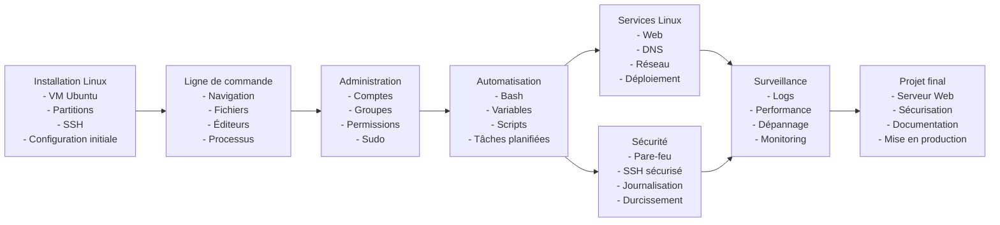
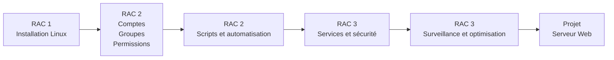
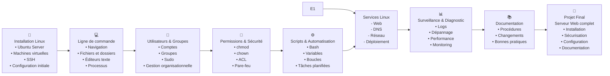
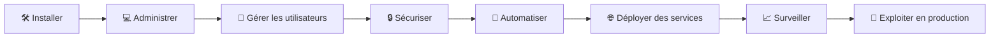

# Plan De Cours

[:tada: Participation](.scripts/Participation.md)

## :a: Github

:round_pushpin: Creer un compte sur [:octocat: Github](https://github.com)

- [ ] Explorer [Github Education](https://education.github.com)

:round_pushpin: Créer une page 

- [ ] créer un répertoire avec son :id: et ajouter le fichier `README.md`
- [ ] créer un répertoire dans son répertoire :id:, ajouter le répertoire `images` et ajouter le fichier `.gitkeep`
- [ ] Ajouter des images dans le répertoire `images`
- [ ] Ajouter les images au fichier `README.md`

---

Ou une version encore plus condensée et orientée RAC :

Voici une version plus engageante, moderne et « étudiant-friendly » du curriculum INF1085, avec quelques émojis pour illustrer le parcours d'apprentissage.

Vue « parcours étudiant »

Résumé du cours en une ligne

🐧 Installer → Administrer → Sécuriser → Automatiser → Déployer → Surveiller → Documenter → Mettre en production un serveur Linux d'entreprise.

| Étape                     | Ce que l'étudiant devient             |
| ------------------------- | ------------------------------------- |
| 🐣 Installation Linux     | Junior Linux User                     |
| 💻 Ligne de commande      | Terminal Ninja                        |
| 👥 Utilisateurs & groupes | Administrateur système                |
| 🔐 Sécurité               | Gardien du serveur                    |
| ⚙️ Scripts Bash           | Automatisation Guru                   |
| 🌐 Services réseau        | Architecte Linux                      |
| 📊 Monitoring             | Dépanneur d'élite                     |
| 🚀 Projet final           | Linux SysAdmin prêt pour l'entreprise |

Cette progression reflète directement les trois RAC du cours : installation, administration des comptes et permissions, puis optimisation, sécurité et surveillance des systèmes Linux.

