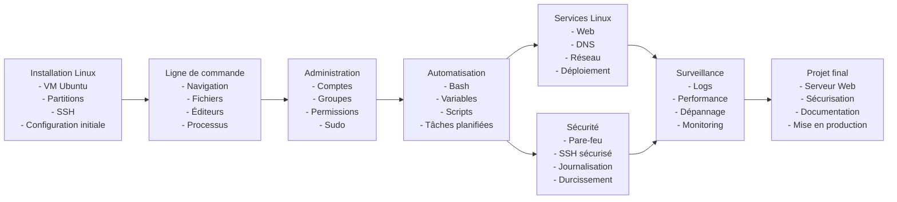
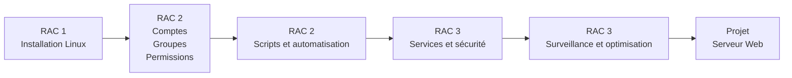

# Plan De Cours

[:tada: Participation](.scripts/Participation.md)

## :a: Github

:round_pushpin: Creer un compte sur [:octocat: Github](https://github.com)

- [ ] Explorer [Github Education](https://education.github.com)

:round_pushpin: Créer une page 

- [ ] créer un répertoire avec son :id: et ajouter le fichier `README.md`
- [ ] créer un répertoire dans son répertoire :id:, ajouter le répertoire `images` et ajouter le fichier `.gitkeep`
- [ ] Ajouter des images dans le répertoire `images`
- [ ] Ajouter les images au fichier `README.md`

---

Ou une version encore plus condensée et orientée RAC :

Sommaire du curriculum – INF1085 Administration Linux

Le cours Automne-2026-INF-1085-201-04-Administration-Linux.pdf (INF1085-201 Administration Linux) est un cours de 56 heures du programme Techniques des systèmes informatiques, offert à l'automne 2026. Le préalable est INF1092-200 ou INF1092-201.

Description du cours

Le cours porte sur l'administration avancée de systèmes Linux en réseau, notamment :

l'installation et la configuration d'un système Linux;
l'organisation d'un domaine;
la gestion avancée des utilisateurs et des groupes;
la gestion des permissions et privilèges d'accès;
l'administration, la sécurité, la surveillance et l'automatisation du système.
Résultats d'apprentissage (RAC)
1. Installer un système d'exploitation en réseau

Les étudiants apprennent à :

installer et configurer Linux dans différents environnements;
effectuer les mises à jour;
installer des services et applications serveur;
documenter l'installation et la configuration.
2. Gérer les comptes et les groupes

Les étudiants apprennent à :

administrer les utilisateurs et groupes;
gérer les permissions et privilèges;
organiser les comptes selon la structure d'une entreprise;
automatiser des tâches administratives à l'aide de scripts.
3. Optimiser et surveiller un système Linux

Les étudiants apprennent à :

appliquer des mesures de sécurité;
diagnostiquer et résoudre des problèmes système;
adapter la configuration selon les besoins de l'entreprise;
documenter les changements;
automatiser la surveillance et l'administration.
Évaluation

Évaluation	%Laboratoire : Installation initiale	10
Quiz : Installation et configuration initiale	10
Laboratoire : Gestion des comptes, processus et permissions	10
Laboratoire : Ligne de commande	10
Quiz : Gestion des comptes, processus et permissions	10
Laboratoire : Installation d'application	10
Laboratoire : Configuration	10
Quiz : Configuration et surveillance	10
Projet de session : Mise en fonction d'un serveur Web	20

La note de passage est de 60 % (C-).

Compétences développées

Le cours contribue aux compétences du programme en :

administration de systèmes informatiques;
sécurité des environnements informatiques;
diagnostic et dépannage;
automatisation par scripts;
déploiement et maintenance d'infrastructures;
documentation technique;
résolution de problèmes et gestion du temps.
Résumé en une phrase

INF1085 prépare l'étudiant à installer, administrer, sécuriser, surveiller et automatiser des serveurs Linux en entreprise, avec un accent important sur les comptes, permissions, scripts et services réseau.

# References
